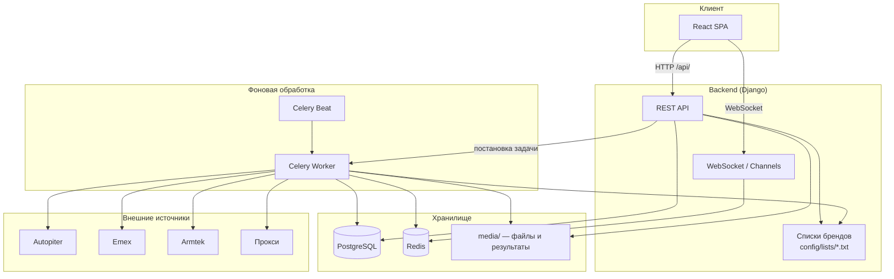

# Система парсинга автозапчастей

Система для парсинга брендов автозапчастей с сайтов Autopiter, Emex и Armtek.

## Возможности

- Парсинг брендов с трех источников: Autopiter, Emex, Armtek
- Выбор источников для парсинга
- Загрузка Excel-файлов с артикулами
- Отслеживание прогресса в реальном времени
- Сохранение результатов в Excel-файлы
- Управление пользователями
- Ротация прокси для обхода блокировок
- **Редактирование списков брендов и чёрных списков через веб-интерфейс**

## Архитектура системы



### Поток обработки задачи парсинга

1. Пользователь загружает Excel на странице «Загрузка» и выбирает источники.
2. Django создаёт `ParsingTask` и ставит задачу в Celery.
3. Celery читает строки файла (бренд, артикул, кросс-номера), парсит каждый источник параллельно.
4. Результаты фильтруются по спискам из `config/lists/` (бренды Armtek, чёрные списки Autopiter/Emex).
5. Прогресс транслируется через WebSocket; по завершении формируются Excel-файлы в `media/results/`.

## Установка и запуск

### Через Docker (рекомендуется)

```bash
# Клонирование репозитория
git clone <repository-url>
cd AutoParts

# Запуск системы
docker-compose up -d

# Применение миграций
docker-compose exec backend python manage.py migrate

# Создание суперпользователя
docker-compose exec backend python manage.py createsuperuser
```

### Локальная установка

```bash
# Установка зависимостей
pip install -r requirements.txt

# Настройка базы данных
python manage.py migrate

# Создание суперпользователя
python manage.py createsuperuser

# Запуск сервера
python manage.py runserver
```

## Управление пользователями

### Через скрипт (рекомендуется)

```bash
# Создание нового пользователя
python manage_users.py create username email password

# Просмотр списка пользователей
python manage_users.py list

# Удаление пользователя
python manage_users.py delete username

# Изменение пароля
python manage_users.py change_password username new_password

# Справка
python manage_users.py help
```

### Через Django admin

```bash
# Создание суперпользователя для доступа к админке
python manage.py createsuperuser

# Запуск сервера
python manage.py runserver

# Открыть http://localhost:8000/admin/
```

## Использование системы

1. **Вход в систему**
   - Откройте http://localhost:3000 (или ваш домен)
   - Войдите с созданными учетными данными

2. **Загрузка файла**
   - Перейдите на страницу «Загрузка»
   - Выберите Excel-файл с артикулами
   - Выберите источники для парсинга (Autopiter, Emex, Armtek)
   - Нажмите «Начать обработку»

3. **Отслеживание прогресса**
   - Перейдите на страницу «Задачи»
   - Следите за прогрессом в реальном времени
   - Скачайте готовые файлы по завершении

4. **Управление списками брендов** (только для staff-пользователей)
   - Перейдите на страницу «Списки брендов»
   - Редактируйте списки в текстовом редакторе или загрузите `.txt`/`.csv` файл
   - Изменения применяются к новым задачам парсинга без перезапуска сервера

## Формат входного файла

Excel-файл (`.xlsx`) с колонками:

| Колонка | Поле | Описание |
|---------|------|----------|
| B | Наименование | Название детали |
| E | Бренд № 1 | Исходный бренд |
| F | Артикул | Номер детали по бренду № 1 |
| G | Кросс-номера | Дополнительные артикулы для поиска (через запятую или перенос строки) |

### Пример входного файла

| B (Наименование) | E (Бренд) | F (Артикул) | G (Кросс-номера) |
|------------------|-----------|-------------|------------------|
| Фильтр масляный | MANN | W712/75 | W71275, OC534 |
| Прокладка ГБЦ | HINO | 11115-E0G80 | 11115E0G80 |
| Тормозные колодки | JMC | 3501105-PAA | — |

## Формат выходных файлов

Для каждого выбранного источника создаётся отдельный Excel-файл: `{источник}_results_{id_задачи}.xlsx`

### Пример выходного файла (Autopiter)

| Бренд № 1 | Артикул по Бренду № 1 | Наименование | Бренд № 2 | Артикул по Бренду № 2 | Источник |
|-----------|----------------------|--------------|-----------|----------------------|----------|
| MANN | W712/75 | Фильтр масляный | MANN-FILTER | W71275 | autopiter |
| HINO | 11115-E0G80 | Прокладка ГБЦ | HINO | 11115E0G80 | autopiter |

### Пример выходного файла (Armtek)

| Бренд № 1 | Артикул по Бренду № 1 | Наименование | Бренд № 2 | Артикул по Бренду № 2 | Источник |
|-----------|----------------------|--------------|-----------|----------------------|----------|
| JMC | 3501105-PAA | Тормозные колодки | JMC | 3501105-PAA | armtek |
| JMC | 3501105-PAA | Тормозные колодки | Бренды не найдены | 3501105-PAA | armtek |

## Управление списками брендов и чёрными списками

Списки хранятся в `backend/config/lists/` (одна запись на строку):

| Файл | Назначение |
|------|------------|
| `armtek_ui_garbage.txt` | Элементы UI Armtek, не являющиеся брендами |
| `armtek_extra_garbage.txt` | Дополнительные слова для фильтрации мусора Armtek |
| `armtek_whitelist.txt` | Известные бренды Armtek (всегда проходят фильтрацию) |
| `autopiter_blacklist.txt` | Чёрный список для Autopiter |
| `emex_blacklist.txt` | Чёрный список для Emex |

Файлы создаются автоматически при первом обращении с значениями по умолчанию. Редактирование доступно через веб-интерфейс («Списки брендов») или напрямую в файлах.

### Пример файла `armtek_whitelist.txt`

```text
# Известные бренды Armtek
QUNZE
NIPPON
JMC
HINO
TOYOTA
ZEVS
```

### Пример файла `autopiter_blacklist.txt`

```text
# Слова, которые не являются брендами
фильтр
ремень
дизель
артикул
производители
```

## Структура проекта

```
AutoParts/
├── backend/                 # Django backend
│   ├── api/                # API endpoints, парсеры, Celery-задачи
│   │   ├── autopiter_parser.py
│   │   ├── brand_config.py      # Загрузка списков брендов
│   │   ├── brand_defaults.py    # Значения по умолчанию
│   │   └── tasks.py
│   ├── config/lists/       # Редактируемые списки брендов
│   ├── core/               # Основные модели
│   └── manage_users.py     # Скрипт управления пользователями
├── frontend/               # React frontend
│   ├── src/pages/         # Страницы приложения
│   └── package.json
├── docker-compose.yml
└── README.md
```

## Добавление нового источника парсинга

Чтобы подключить новый сайт (например, `newsource`):

### 1. Парсер

В `backend/api/autopiter_parser.py` (или отдельном модуле) добавьте функцию:

```python
def get_brands_by_artikul_newsource(artikul: str, proxy=None) -> List[str]:
    """Парсинг брендов с NewSource."""
    # HTTP/Selenium/API логика
    return filtered_brands
```

При необходимости добавьте чёрный список в `brand_config.py` и `brand_defaults.py`.

### 2. Celery-задача

В `backend/api/tasks.py`:

- Импортируйте новую функцию парсера
- Добавьте `'newsource'` в обработку `selected_sources`
- Добавьте цикл парсинга и сохранение в `results_newsource`
- Сформируйте выходной файл `newsource_results_{task_id}.xlsx`

### 3. API

В `backend/api/views.py` добавьте `'newsource'` в список допустимых источников при создании задачи.

### 4. Frontend

- `frontend/src/pages/Upload.js` — чекбокс нового источника
- `frontend/src/pages/Tasks.js` — добавьте источник в `allowedSites` для скачивания

### 5. Модели (опционально)

В `backend/core/models.py` добавьте источник в `PriceListTask.platform`, если нужен анализ прайс-листов.

### 6. Чёрный список (рекомендуется)

1. Добавьте `newsource_blacklist` в `LIST_META` и `DEFAULT_LISTS` в `brand_config.py` / `brand_defaults.py`
2. Используйте `get_blacklist_for_source('newsource')` в фильтре результатов
3. Список автоматически появится на странице «Списки брендов»

## Настройка прокси

1. Создайте файл `proxies.txt` в корне проекта
2. Добавьте прокси в формате `ip:port` (по одному на строку)
3. Загрузите файл через веб-интерфейс на странице «Прокси»

## Мониторинг и логи

- Логи Celery: `docker-compose logs celery`
- Логи Django: `docker-compose logs backend`
- Логи Nginx: `docker-compose logs nginx`

## Устранение неполадок

### Проблемы с подключением к базе данных

```bash
docker-compose ps
docker-compose restart db
docker-compose exec backend python manage.py migrate
```

### Проблемы с парсингом

- Проверьте доступность прокси
- Убедитесь, что сайты доступны
- Проверьте логи на наличие ошибок
- Проверьте актуальность чёрных списков на странице «Списки брендов»

### Проблемы с производительностью

- Увеличьте лимиты памяти в docker-compose.yml
- Настройте количество воркеров Celery
- Оптимизируйте размер входных файлов

## Лицензия

Проект разработан для внутреннего использования.
